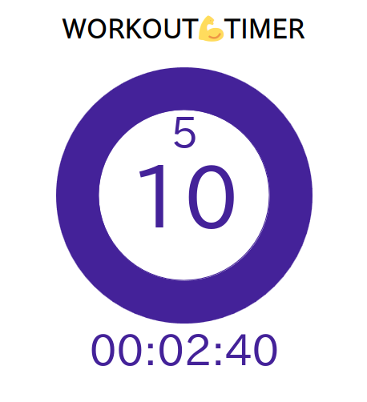
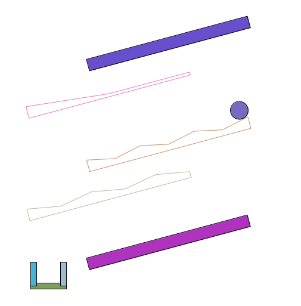

# p5sample

## 開発言語
JavaScript  
tsconfig.jsonを使っていますがTypeScriptは使っていません。  
開発時にIDEにjsの型チェックをしてもらうためにtsconfigを設定しています。  

## WORKOUT💪TIMER
筋肉トレ用のタイマーです。   
https://naosim.github.io/p5sample/workout-timer/  
  

## ブロック崩し
https://naosim.github.io/p5sample/block-kuzusi/  
  

## スイカゲーム
https://naosim.github.io/p5sample/suika/  
未完成

## ボールころがし
https://naosim.github.io/p5sample/friend-park/  
  